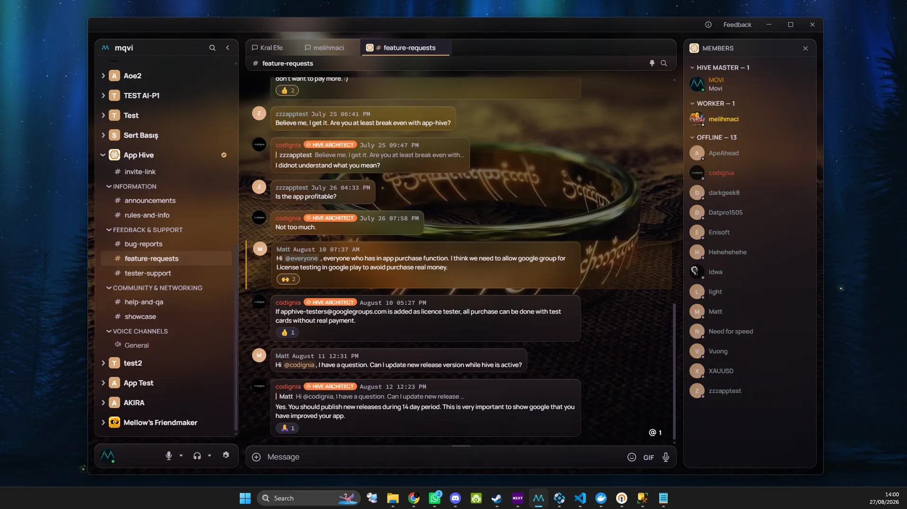
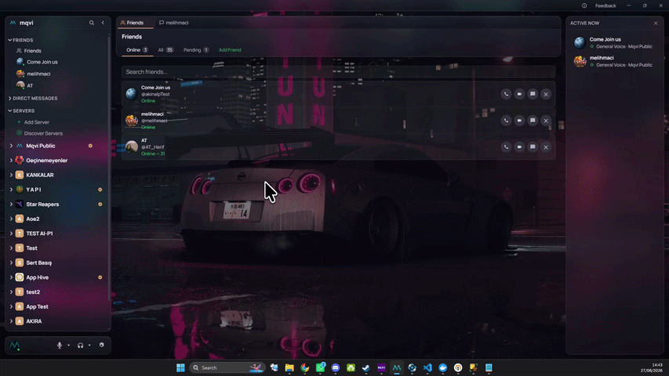
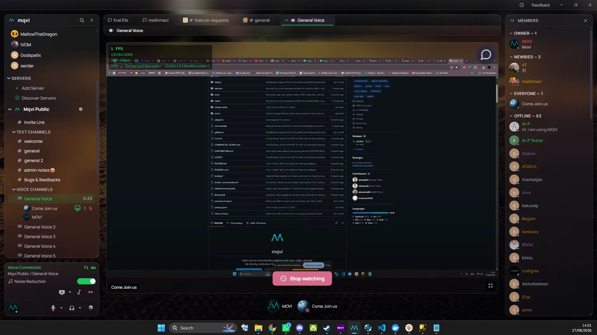
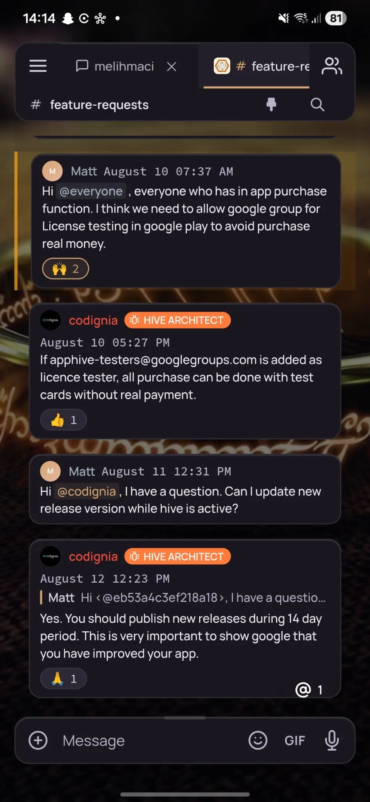

<p align="center">
  
</p>

<h1 align="center">mqvi</h1>

<p align="center">
  <b>An open-source communication platform — voice, video and text — with always-on call encryption.</b><br/>
  Create an account at <a href="https://mqvi.net">mqvi.net</a> and start talking, or host the whole thing yourself.
</p>

<p align="center">
  <a href="LICENSE"></a>
  <a href="https://github.com/akinalpfdn/Mqvi/stargazers"></a>
  <a href="https://github.com/akinalpfdn/Mqvi/releases/latest"></a>
  <a href="https://github.com/akinalpfdn/Mqvi/commits/main"></a>
  
</p>

<p align="center">
  <a href="https://github.com/akinalpfdn/Mqvi/releases/latest/download/mqvi-setup.exe"></a>&nbsp;&nbsp;
  <a href="https://github.com/akinalpfdn/Mqvi/releases/latest/download/mqvi-setup.dmg"></a>&nbsp;&nbsp;
  <a href="https://github.com/akinalpfdn/Mqvi/releases/latest/download/mqvi-setup.AppImage"></a>
</p>

<p align="center">
  <sub>Also on iOS and Android &middot; close to 1,000 registered accounts</sub>
</p>

<p align="center">
  <a href="https://mqvi.net">Website</a> &middot;
  <a href="#features">Features</a> &middot;
  <a href="#privacy-what-we-hold-and-what-we-never-do">Privacy</a> &middot;
  <a href="#self-hosting">Self-Host</a> &middot;
  <a href="ARCHITECTURE.md">Architecture</a> &middot;
  <a href="README.tr.md">🇹🇷 Türkçe</a>
</p>

<p align="center">
  
</p>

<p align="center">
  
</p>

---

## Features

- ✅ **Voice and video, end-to-end encrypted on every call** — not a mode you switch on, and not only
  in DMs. Per-room SFrame keys, on hosted and self-hosted servers alike.
- ✅ **End-to-end encrypted messaging, on the Signal protocol design** — X3DH and the Double
  Ratchet for DMs, Sender Keys for channels, per-device identity keys, and password-based key
  recovery so a new device is not a dead end. Opt-in per server or per DM.
- ✅ **Screen sharing that does not cost you frames** — on Windows a native Rust pipeline captures via
  Windows Graphics Capture and encodes on the GPU through Media Foundation, publishing straight to
  the SFU instead of making the browser do it.
- ✅ **Five platforms from one codebase** — Windows, macOS, Linux, iOS and Android, with auto-update
  and differential patching on desktop and native call handling on mobile.
- ✅ **Servers, channels and roles** — categories, per-channel permission overrides, invites, join
  approval, public discovery, pinning and full-text search.
- ✅ **Voice that behaves** — push-to-talk or voice activity detection, per-user volume, two
  noise-suppression engines, AFK disconnect, and permission changes that take effect mid-call rather
  than at the next join.
- ✅ **No phone number and no ID, ever** — email is optional.
- ✅ **Self-hostable in one command** — the same platform, on your own machine, with no runtime to
  install.
- 🚧 **Plugin and bot API** — planned.
- 🚧 **Federation between servers** — planned.

<table>
  <tr>
    <td width="62%"></td>
    <td width="38%"></td>
  </tr>
  <tr>
    <td align="center"><sub>A voice channel, someone sharing their screen</sub></td>
    <td align="center"><sub>The same chat on a phone</sub></td>
  </tr>
</table>

---

## Privacy: what we hold, and what we never do

Being precise about this is worth more than a slogan.

**Never collected** — phone numbers, government ID, contact lists, advertising or behavioural
profiles. Email is optional. No tracking, no analytics SDK, nothing sold or shared with anyone.

**Held on mqvi.net** — your account, friend list, server memberships and messages. Turn encryption on
for a server or a DM and the server stops being able to read those messages at all; it then
*enforces* that, rather than trusting the client to.

**Voice and video** need no asterisk. They are end-to-end encrypted on every call, on every server,
whoever runs it.

If you would rather none of it touched our machines, that option is a single command away — and the
fact that it exists is what makes the rest of this checkable rather than a promise.

---

## Self-hosting

Two ways, depending on how much you want to run.

**Your own voice server, our accounts.** Keep using mqvi.net normally; only voice and video traffic
moves to your machine. One line, and 1 GB of RAM is enough.

**The whole platform.** Accounts, messages, files, voice — all yours:

```bash
curl -fsSL https://raw.githubusercontent.com/akinalpfdn/Mqvi/main/deploy/install.sh | sudo bash
```

That is the whole thing. The installer creates a dedicated system user, fetches a prebuilt binary
with the frontend embedded, stands up a LiveKit SFU, generates your secrets, installs hardened
systemd units, and configures Caddy with automatic HTTPS. No Go, Node.js or Docker required. No
domain required either — it falls back to a free `sslip.io` hostname and still gets a real
certificate, because browsers block microphone and screen share without HTTPS.

Both modes, with backups, ports and configuration: **[SELF-HOSTING.md](SELF-HOSTING.md)**.

---

## How it works

```
   HOSTED  (the usual way)                    FULL SELF-HOST

   mqvi.net ── accounts, friends, DMs         your server
        │                                     ├── accounts
        ├── your servers & channels           ├── channels & messages
        │                                     ├── voice — your SFU
        └── voice ── ours, or point it        └── files
                     at your own SFU
```

One account on mqvi.net carries your identity, friends and memberships, so there is nothing to set
up to start using mqvi. **Servers** — where channels and voice live — can be hosted by us or by you,
and you can mix the two.

---

## How it compares

Checked in August 2026. Where a competitor is better, the table says so.

|  | mqvi | Discord | Matrix / Element | Stoat |
|---|---|---|---|---|
| Open source | ✓ AGPL-3.0 | ✗ | ✓ | ✓ AGPL-3.0 |
| Self-hostable | ✓ | ✗ | ✓ | ✓ |
| Standing up your own server | one command | — | involved | Docker Compose |
| Voice & video E2EE | ✓ every call | ✓ every call | ✓ (Element Call) | ✗ planned |
| Message E2EE | ✓ opt-in | ✗ | ✓ on by default in DMs | ✗ planned |
| Phone or ID to sign up | never | often | never | never |
| **Federation** | **✗ planned** | ✗ | **✓** | ✗ |
| **Bots and third-party apps** | **✗ planned** | **✓ large ecosystem** | **✓** | — |
| **Independent audit of the crypto** | **✗** | **✓** | **✓** | — |

The bold rows are the ones mqvi loses, and they are the honest reasons to pick something else:

- **No federation.** Matrix's whole point is that servers talk to each other. mqvi's do not, yet.
- **No bot or app ecosystem.** Discord's is enormous and a decade old. mqvi has none at all.
- **The encryption has not been independently audited.** The primitives come from `@noble/curves`,
  which Cure53 and Trail of Bits have audited — but this project's own X3DH, Double Ratchet and
  Sender Key implementation has not been reviewed by anyone outside it. Discord's DAVE protocol was
  audited by Trail of Bits; Matrix's vodozemac has been audited too. If your threat model is
  serious, that difference matters and you should know about it before trusting this.

What mqvi does have that the others do not: a genuinely one-command install of the *entire*
platform, and always-on call encryption on a stack you can read end to end.

## Tech stack

| Layer | Technology |
|---|---|
| Backend | Go — `net/http` + `gorilla/websocket` |
| Database | SQLite (`modernc.org/sqlite`, pure Go) with FTS5 trigram search |
| Frontend | React + TypeScript + Vite, Zustand, hand-written CSS with theme tokens |
| Desktop | Electron |
| Mobile | Capacitor (iOS + Android) |
| Voice/Video | LiveKit, self-hosted, with SFrame E2EE |
| Messaging E2EE | Signal Protocol (X3DH + Double Ratchet), Sender Keys, `@noble/curves` |
| Native | Rust + Media Foundation + Windows Graphics Capture for GPU screen capture |
| Auth | JWT access + refresh |

The server compiles to a **single static binary** with the frontend embedded — that is why the
one-command install needs no runtime.

---

## Development

```bash
git clone https://github.com/akinalpfdn/Mqvi.git && cd Mqvi

cd server && go run .          # backend
cd client && npm install && npm run dev   # frontend, separate terminal
npm run electron:dev           # desktop shell, from the repo root
```

You need Go 1.22+, Node 22+, and a LiveKit server for voice — `deploy/livekit-setup.sh` sets one up
locally in a few seconds.

**[ARCHITECTURE.md](ARCHITECTURE.md)** explains how the pieces fit together: the layering, the
WebSocket hub, how voice channels bind to LiveKit instances, the encryption model, and the testing
conventions. Deeper per-subsystem notes live in [`architecture/`](architecture/), and
[`DECISIONS.md`](DECISIONS.md) records why things are the way they are.

---

## Contributing

Contributions are welcome. Please read the [Contributing Guide](CONTRIBUTING.md) before opening an
issue or a pull request, and [ARCHITECTURE.md](ARCHITECTURE.md) before your first change.
Security reports go through [SECURITY.md](SECURITY.md), never a public issue.

---

## License

[AGPL-3.0](LICENSE) — free to use, modify and self-host, including inside your organisation. If you
distribute a modified version or offer it to others over a network, you must publish your source
under the same licence. Commercial use outside those terms requires a
[separate licence](COMMERCIAL-LICENSE.md). Contribution terms are in [CLA.md](CLA.md).
